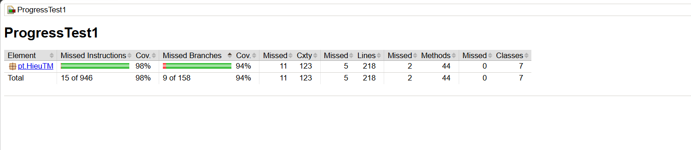

# SWT301 – Progress Test 1: Unit Testing với JUnit 5 & JaCoCo

> **Học phần:** SWT301 – Software Testing  
> **Chủ đề:** Kiểm thử đơn vị module Account Management bằng JUnit 5 & Parameterized Test  
> **Họ và Tên** Trần Minh Hiếu 
> **MSSV** DE200110
> **Thời gian thực hiện:** Học kỳ Fall 2026  

---

## 1. Hướng dẫn cài đặt và thực thi

### Yêu cầu môi trường
* **JDK:** Java 21 
* **Build tool:** Apache Maven 3.9+

### Các lệnh chạy kiểm thử

* **Chạy toàn bộ test suite:**
  ```bash
  mvn clean test
  ```
* **Chạy riêng từng lớp test:**
  ```bash
  # Chạy AccountValidatorTest
  mvn test -Dtest=AccountValidatorTest

  # Chạy AccountServiceTest
  mvn test -Dtest=AccountServiceTest
  ```
* **Tạo báo cáo độ phủ mã nguồn (JaCoCo HTML Report):**
  ```bash
  mvn jacoco:report
  ```
  Báo cáo HTML sẽ được xuất tại thư mục: `target/site/jacoco/index.html`.

---

## 2. Kết quả kiểm thử & Báo cáo JaCoCo Coverage

### 2.1. Thống kê kết quả kiểm thử (Test Execution Summary)
* **Tổng số test runs:** 185 tests (vượt mức yêu cầu tối thiểu $\ge 60$ lượt)
* **Failures:** 0
* **Errors:** 0
* **Skipped:** 0
* **Trạng thái Build:** `BUILD SUCCESS`

### 2.2. Chỉ số độ phủ mã nguồn (Coverage Metrics)
| Tiêu chí | Yêu cầu tối thiểu (Đề bài) | Kết quả đạt được | Trạng thái |
|---|:---:|:---:|:---:|
| **Line Coverage** | $\ge 80\%$ | **98%** (213 / 218 lines) | **Đạt** |
| **Branch Coverage** | $\ge 70\%$ | **94%** (149 / 158 branches) | **Đạt** |

### 2.3. Minh chứng báo cáo JaCoCo


---

## 3. Bảng kiểm thử đột biến thủ công (Manual Mutation Testing)

Đã thực hiện chèn lần lượt từng lỗi giả lập vào mã nguồn production, chạy test để kiểm tra test suite có bắt được lỗi (Fail) hay không, sau đó hoàn tác về trạng thái ban đầu (`git checkout`).

| # | File / Vị trí | Lỗi chèn (Mutation) | Test mong đợi bị Fail | Trạng thái bắt lỗi | Đã hoàn tác |
|---|---|---|---|:---:|:---:|
| **M1** | `AccountService.java` (`login`) | Đổi `>= MAX_FAILED_ATTEMPTS` thành `>` | `AccountServiceTest$Login#login_CorrectPasswordAfterNFailures` / test kiểm tra sai 5 lần phải khóa | **Killed** (Failed đúng kỳ vọng) | [x] |
| **M2** | `AccountService.java` (`login`) | Bỏ qua nhánh `if (acc.isLocked())` | `AccountServiceTest$Login` (Rule 3: test tài khoản đang khóa nhập đúng mật khẩu vẫn bị chặn) | **Killed** (Failed đúng kỳ vọng) | [x] |
| **M3** | `AccountValidator.java` (`USERNAME`) | Mở rộng regex `{4,19}` thành `{4,20}` | `AccountValidatorTest$Username#isValidUsername_BoundaryLength` (biên 21 ký tự) | **Killed** (Failed đúng kỳ vọng) | [x] |

---

## 4. Ma trận truy vết rút gọn (Traceability Matrix: BR $\rightarrow$ Test)

| Business Rule (BR) | Mô tả quy tắc nghiệp vụ | Phương thức / Lớp Test phụ trách |
|---|---|---|
| **BR-REG-01** | Bắt buộc nhập các trường, không null/blank | `AccountServiceTest$Register#register_InvalidInput_ReturnsExpectedCode` |
| **BR-REG-02** | Định dạng username hợp lệ (5–20 ký tự, ký tự đầu là chữ) | `AccountValidatorTest$Username`, `AccountServiceTest$Register` |
| **BR-REG-03** | Username là duy nhất (không phân biệt hoa/thường) | `AccountServiceTest$Register#register_DuplicateUsername_CaseInsensitive` |
| **BR-REG-04** | Định dạng Email hợp lệ | `AccountValidatorTest$Email`, `AccountServiceTest$Register` |
| **BR-REG-05** | Email là duy nhất (không phân biệt hoa/thường) | `AccountServiceTest$Register#register_DuplicateEmail_CaseInsensitive` |
| **BR-REG-06** | Mật khẩu đủ 4 nhóm, dài 8–32 ký tự, không chứa username | `AccountValidatorTest$Password`, `AccountServiceTest$Register` |
| **BR-REG-07** | Mật khẩu xác nhận phải trùng khớp mật khẩu chính | `AccountServiceTest$Register#register_PasswordMismatch` |
| **BR-REG-08** | Người dùng phải đủ 18 tuổi trở lên | `AccountValidatorTest` (`calculateAge`), `AccountServiceTest$Register#register_AgeBoundary` |
| **BR-REG-09** | Định dạng số điện thoại Việt Nam (03, 05, 07, 08, 09) | `AccountValidatorTest$Phone`, `AccountServiceTest$Register` |
| **BR-REG-10** | Thứ tự ưu tiên xác thực khi vi phạm nhiều quy tắc | `AccountServiceTest$Register#register_PriorityOrderTests` |
| **BR-LOG-01** | Bắt buộc nhập username và password khi đăng nhập | `AccountServiceTest$Login#login_EmptyOrBlankCredentials` |
| **BR-LOG-02** | Thông tin đăng nhập không hợp lệ trả `INVALID_CREDENTIALS` | `AccountServiceTest$Login#login_NonExistentUser_OrWrongPassword` |
| **BR-LOG-03** | Tài khoản bị vô hiệu hóa trả `ACCOUNT_DISABLED` | `AccountServiceTest$Login#login_DisabledAccount` |
| **BR-LOG-04** | Sai mật khẩu tăng bộ đếm số lần sai | `AccountServiceTest$Login#login_WrongPasswordIncrementsCounter` |
| **BR-LOG-05** | Đăng nhập sai 5 lần liên tiếp sẽ tự động khóa tài khoản | `AccountServiceTest$Login#login_CorrectPasswordAfterNFailures` (biên 4 vs 5) |
| **BR-LOG-06** | Đăng nhập thành công trả về `SUCCESS` và reset bộ đếm về 0 | `AccountServiceTest$Login#login_Success_ResetsCounter` |
| **BR-ADM-01..03** | Vô hiệu hóa (`disableAccount`), mở khóa (`unlockAccount`), tìm kiếm | `AccountServiceTest$Admin#unlockAccount_ResetsCounterAndAllowsLogin` |
| **BR-BONUS** | Đổi mật khẩu & Reset mật khẩu qua mã xác nhận | `AccountServiceTest$ChangePassword`, `AccountServiceTest$ResetPassword` |

---

## 5. Checklist tự đánh giá (Self-Assessment Checklist)

### A. Mã production
- [x] **A1** `mvn clean compile` thành công không lỗi.
- [x] **A2** `AccountValidator` đủ 5 hàm, tham số `null` trả về `false`, không ném NullPointerException.
- [x] **A3** Mật khẩu băm an toàn bằng SHA-256 kèm salt ngẫu nhiên, không lưu hay so sánh dạng text thô.
- [x] **A4** `register()` cài đặt đầy đủ BR-REG-01..10 đúng thứ tự kiểm tra.
- [x] **A5** `login()` khóa tài khoản ở lần sai thứ 5; đang khóa không tăng biến đếm; thành công reset về 0.
- [x] **A6** `unlockAccount()` mở khóa và đặt lại `failedAttempts = 0`.
- [x] **A7** Username và email xử lý không phân biệt hoa/thường (`Locale.ROOT`), mật khẩu phân biệt chữ hoa/thường.
- [x] **A8** Không dùng `System.currentTimeMillis()` hoặc `Clock` gây phụ thuộc; không để sót `System.out.println`.

### B. Mã test
- [x] **B1** Đạt $\ge 20$ test methods, $\ge 12$ `@ParameterizedTest`, đạt **185** lượt chạy kiểm thử.
- [x] **B2** Sử dụng đầy đủ các annotation nguồn dữ liệu: `@ValueSource`, `@NullAndEmptySource`, `@CsvSource`, `@MethodSource`.
- [x] **B3** Kiểm thử đầy đủ giá trị biên: username 4/5/20/21, password 7/8/32/33, email 100/101, tuổi 17/18.
- [x] **B4** Kiểm thử biên số lần đăng nhập thất bại 4/5 và kịch bản mở khóa admin.
- [x] **B5** Có ít nhất 3 kịch bản kiểm tra thứ tự ưu tiên lỗi vi phạm trong `register()`.
- [x] **B6** Tổ chức test theo `@Nested`, mỗi test case được khởi tạo service mới độc lập qua `@BeforeEach`.
- [x] **B7** Kiểm tra sâu trạng thái đối tượng (state verification: status, lock, failed count), không assert rỗng (`assertTrue(true)`).
- [x] **B8** Đặt tên test chuẩn theo mẫu `method_TinhHuong_KetQua` và cấu trúc 3A (Arrange - Act - Assert).

### C. Đóng gói và nộp bài
- [x] **C1** `mvn clean test` đạt 100% Passed (0 failures / errors / skipped).
- [x] **C2** JaCoCo Line coverage $\ge 80\%$, Branch coverage $\ge 70\%$ kèm ảnh chụp minh chứng.
- [x] **C3** Ghi nhận đầy đủ 3 đột biến kiểm thử thủ công và đã hoàn tác mã nguồn.
- [x] **C4** Lịch sử commit tuân thủ quy chuẩn Conventional Commits.
